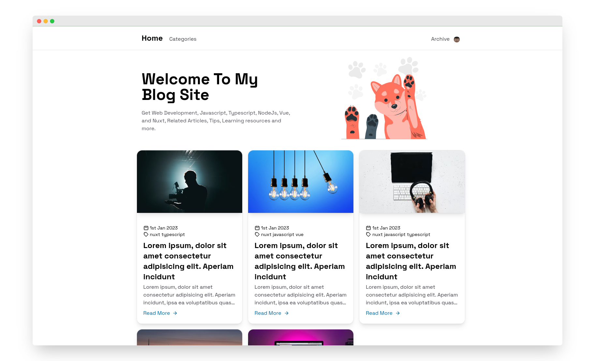
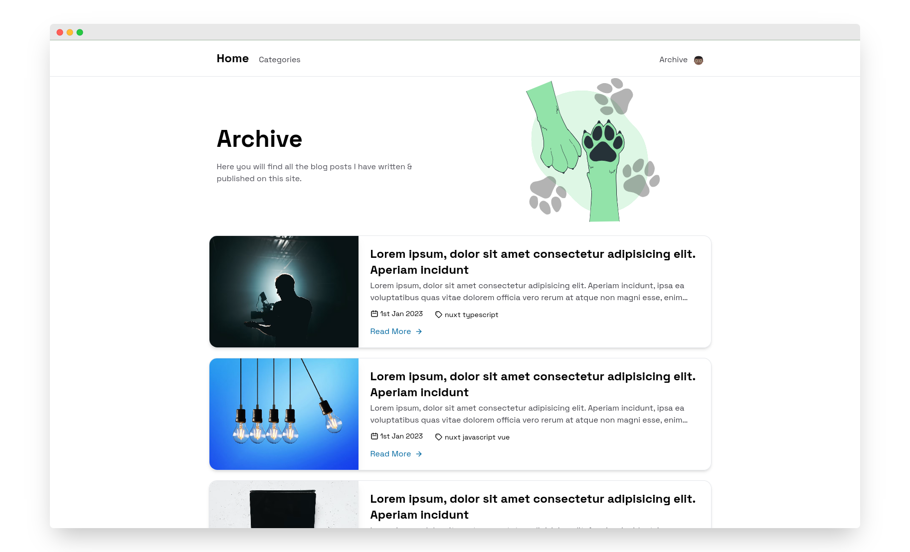

# Personal Blog Site

### Built with

<p align="center">
    
</p>

Hacker News clone built with [Nuxt3](https://nuxt.com), [Nuxt-Content2](https://content.nuxtjs.org/blog/announcing-v2/), [Vue3](https://vuejs.org) & [TailwindCss](https://tailwindcss.com/)

## Features

- Server Side Rendered(SSR) with Nuxt3
- Full Typescript support 
- Use Nuxt-Content-v2 as CMS to utilize MDC syntax
- Added Nuxt Image
- Properly Search Engin optimized
- Use TailwindCss For designing

## Preview

<p align="center">
  <a href="https://blog.nurriyad.xyz" target="_blank">
    
    
    
    
    
    

    <br>
    Live Demo
  </a>
</p>

## Demo

https://blog.nurriyad.xyz

> Hosted on [Vercel](https://vercel.com/): `npm run build`

## Build Setup

**Requires Node.js 16+**

```bash
# install dependencies
yarn install

# serve in dev mode, with hot reload at localhost:5173
yarn run dev

# build for production
yarn run build

# serve in production mode
yarn run  preview

```
