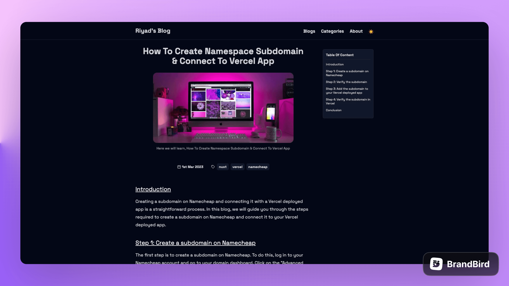

<p align="center">
  <a href="https://blog-nurriyad.vercel.app" target="_blank">
    
  </a>
</p>

<h1 align="center">Nuxt Blog A Personal Blog Site</h1>

### Built with

<p align="center">
    
</p>

Nuxt Blog is a personal blog built with [Nuxt 4](https://nuxt.com), [Nuxt Content 3](https://content.nuxt.com/), [Vue 3](https://vuejs.org), and [Tailwind CSS](https://tailwindcss.com/). It is deployed on [Vercel](https://vercel.com/).

## Features

- Write blog with markdown file
- Auto generate category from blog post
- Blog list page with search and pagination
- About me page for user info
- Auto generate table of content for blog post
- Auto generate Sitemap
- Url preview with Nuxt ogImage
- Dark and light mode
- Server-side rendering (SSR) with Nuxt 4
- RSS feed

## How to Make This Blog Template Yours in 5 Minutes

- Clone this repo or use it as a template
- Go to `./app/data/index.ts` file & add your personal info
- Then head over to the `./content/blogs` folder to add new blogs
- Voilà! You've got a personalized blog site!

## Preview

<p align="center">
  <a href="https://blog-nurriyad.vercel.app" target="_blank">
    
    
    
    
    <br>
    Live Demo
  </a>
</p>

## Demo

https://blog-nurriyad.vercel.app

> Hosted on [Vercel](https://vercel.com/): `npm run build`

## Build Setup

Requires Node.js `22.14.0` (see `.nvmrc`) and npm.

```bash
# install dependencies from the lockfile
npm ci

# start the development server
npm run dev

# build for production
npm run build

# serve in production mode
npm run preview

# lint and check formatting
npm run lint
npm run format

```

See [AGENTS.md](AGENTS.md) for blog post frontmatter, authoring instructions, and repository guidance for coding agents.
